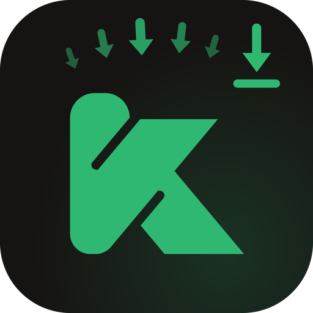
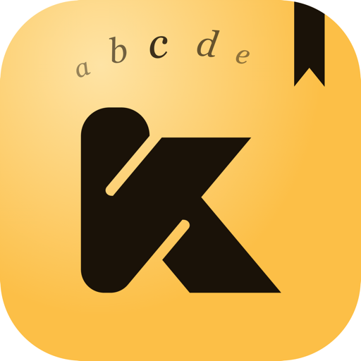

# Kollersi Apps

Bộ ứng dụng Kollersi — tải, đọc, xem và nghe mọi nội dung số.

---

## KDown

**Tải file hàng loạt từ mã chia sẻ.** Nhập mã 8 ký tự, chọn file cần tải và để KDown tự động xử lý song song — hỗ trợ EPUB, PDF, CBZ, M4B, MP4 và nhiều định dạng khác.

 

 

---

## KBooks

**Đọc sách số thông minh.** Thư viện sách cá nhân hoá với trải nghiệm đọc mượt mà — hỗ trợ EPUB, PDF và nhiều định dạng phổ biến. Đồng bộ tiến độ đọc trên mọi thiết bị.

 

 

---

## KFilms

**Xem phim và video chất lượng cao.** Trình phát media mạnh mẽ hỗ trợ đa định dạng — MKV, MP4, TS và nhiều hơn nữa. Giao diện tối giản, tập trung vào nội dung.

 

 

---

## KMusic

**Nghe nhạc và audiobook không giới hạn.** Trình phát âm thanh với thiết kế tối giản — hỗ trợ MP3, M4B, FLAC và các định dạng audio phổ biến. Nghe sách nói trực tiếp từ thư viện cá nhân.

 

 

---

Made with ♥ by [Kollersi](https://kollersi.com)

